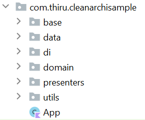
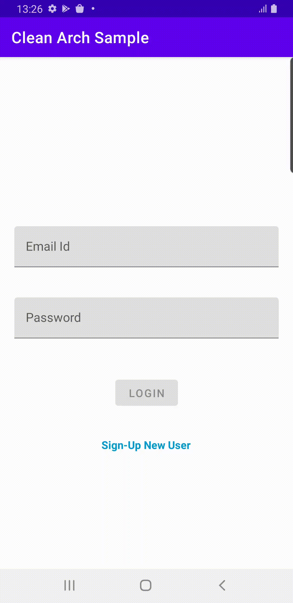
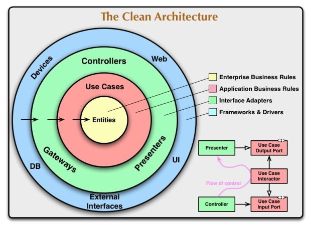

# Android-Clean-Architecture-MVVM-Koin-Room-Rxjava-DataBinding
This project aims to demonstrate the usage of Android-Clean-Architecture with MVVM-Koin-Room-Rxjava-DataBinding in Kotlin.

### Project Structure

### Developed With
* MVVM
* KOIN
* ROOM
* RXJAVA
* DATA-BINDING

## Demo
### Registration

### Login

## Clean Architecture
MVVM with Clean Architecture is pretty good in such cases. It goes one step further in separating the responsibilities of your code base. It clearly abstracts the logic of the actions that can be performed in your app.

### Data
For this project, our data layer contains database and DAO classes, repositoriess.

### Domain
For this project, domain layer contains model objects, use cases, and repository interfaces

### Presenters
 This layer contains UI(Activities and ViewModels)
 
 ### di
 This layer contains dependency injection related items. We maintain all the injection module here.
